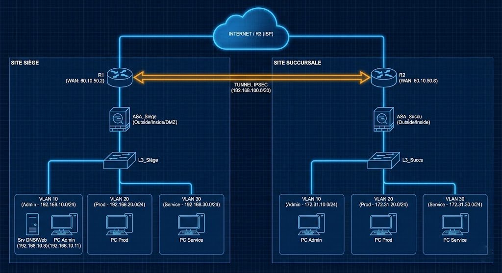
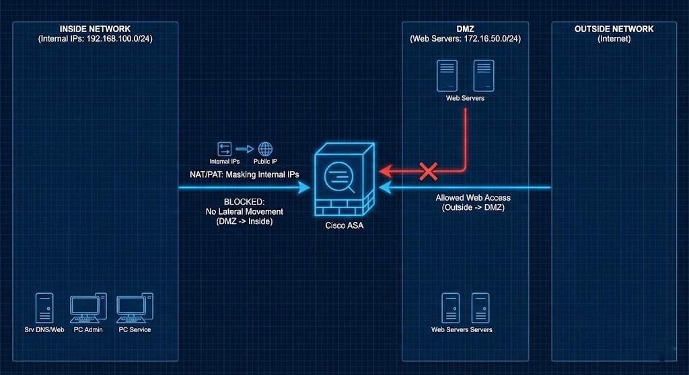
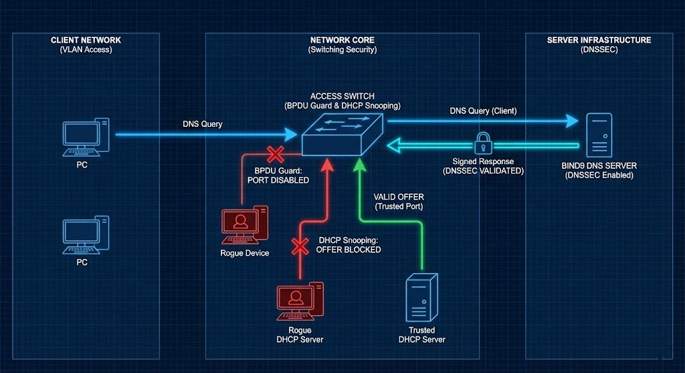
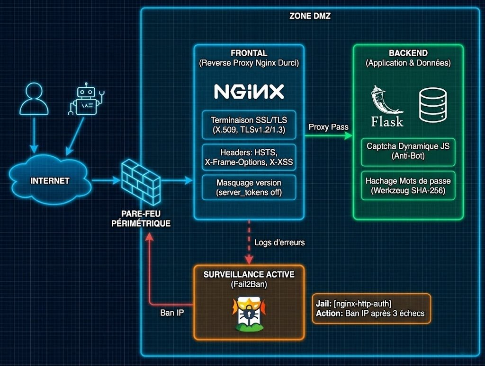
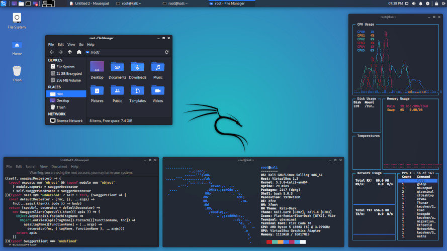

<div align="center">

  

  # SAE 4.01 : Sécuriser un Système d'Information
  
  **Durcissement d'infrastructure, DNSSEC & Web Application Firewall (WAF)**

  
  
  
  

  <br>

  [Description](#-description) •
  [Fonctionnalités](#-fonctionnalités) •
  [Stack Technique](#-stack-technique) •
  [Structure](#-structure) •
  [Installation](#-installation) •
  [Phases du Projet](#-phases-du-projet) •
  [Bilan](#-bilan) •
  [Auteurs](#-auteurs) 

</div>

---

## 📝 Description

Ce projet vise à **renforcer la sécurité d'une infrastructure réseau multi-sites** (Siège et Succursale) reliés par un tunnel IPSEC.
L'objectif est de protéger le système d'information contre des attaques courantes telles que l'empoisonnement de cache DNS, les attaques MITM et les injections Web.

L'architecture est segmentée en trois zones distinctes pour limiter la surface d'attaque :
* **Admin (VLAN 10) :** Serveurs critiques (DNS, Web).
* **Production (VLAN 20) :** Systèmes industriels.
* **Service (VLAN 30) :** Utilisateurs standards.

---

## ✨ Fonctionnalités

### 🛡️ Sécurité Réseau
* **Segmentation & Filtrage :** Cloisonnement par VLANs et filtrage strict via ACLs (ex: interdiction ping Prod <-> Service).
* **Pare-feux ASA :** Inspection de paquets (DPI) et gestion de zones de sécurité (Inside 100, Outside 0, DMZ 50).
* **Redondance :** Haute disponibilité des passerelles via protocole **HSRP**.
* **Confidentialité :** Tunnel VPN IPSEC pour les communications inter-sites.

### 🔐 Services Sécurisés
* **DNSSEC :** Signature cryptographique de la zone `societe2.pepiniere.rt` (clés KSK/ZSK) pour garantir l'authenticité des réponses.
* **Web Application Firewall (WAF) :** Configuration Nginx avancée (HSTS, Anti-XSS, Anti-Clickjacking).
* **Authentification Forte :** Application Flask avec hashage des mots de passe (Werkzeug) et **CAPTCHA dynamique** fait maison pour contrer le brute-force.

---

## 🛠 Stack Technique

### Infrastructure & Réseau


### Système & Services


### Application Web & Données

-009639?style=for-the-badge&labelColor=404040&logo=nginx&logoColor=white)


### Outils de Pentest


---

## 📂 Structure

L'arborescence du projet est organisée comme suit :

```text
📂 SAE4.Cyber.01 - Sécuriser un système d’information/
├── 📂 Organisation/
│   ├── 📊 Matrice RACI.xlsx               # Répartition des rôles
│   └── 📄 Shéma-Réseau.drawio             # Schéma d'architecture éditable
│
├── 📂 Pentest/
│   ├── 📄 Exemple pentest.docx            # Méthodologie et tests
│   └── 📄 Rapport pentest.docx            # Résultats des audits
│
├── 📂 Recommendations ANSSI/
│   ├── 📊 Recommandation_Anssi_...xlsx    # Tableau de suivi de conformité
│   └── 📄 Synthèse des recommandations.docx
│
└── 📂 Réseau/
    ├── 📂 Config maquette/
    │   ├── 📂 Brouillon/
    │   │   ├── 📄 Config.docx
    │   │   ├── 📄 Vrai brouillon.docx
    │   │   └── 🔌 test.pkt                # Test Packet Tracer
    │   │
    │   ├── 📂 ISO pour GNS3/
    │   │   └── 📄 ISO.docx
    │   │
    │   ├── 📂 Pare-Feu/
    │   │   └── 🔌 config-router.pkt       # Config Firewall Cisco
    │   │
    │   ├── 📂 Routeur/
    │   │   ├── 📄 commandes routeur.docx  # Mémo commandes
    │   │   ├── 📄 config routeur.docx     # Configuration appliquée
    │   │   └── 📄 router cisco.docx
    │   │
    │   └── 📂 Switch/
    │       ├── 📄 commandes switch.docx
    │       └── 📄 config switch.docx
    │
    ├── 📂 Services/
    │   ├── 📂 Serveur Web/
    │   │   ├── 📄 Rapport serveur web.docx
    │   │   └── 📄 Sécur web.docx          # Durcissement Nginx/Apache
    │   │
    │   └── 📂 Serveur Windows/
    │       └── 📄 Windows.docx            # Config DNS / AD
    │
    ├── 🔌 Maquettefinale.pkt              # Simulation finale Packet Tracer
    ├── 📄 README.md                       # Documentation du projet
    ├── 🔌 SansACL.pkt                     # Version sans filtrage
    ├── 📄 Write Up.docx                   # Rapport technique (Word)
    ├── 📄 Write Up.pdf                    # Rapport technique (PDF)
    └── 🔌 test.pkt                        # Fichier de test réseau
```
---

## ⚙ Installation

### 1. Clone du Dépot 

```bash
git clone [https://github.com/PierreFamchon/System-Network-Infrastructure.git](https://github.com/PierreFamchon/System-Network-Infrastructure.git)
cd Corporate-Security-Integration
cd InfoSec-Infrastructure-Hardening
```
### 2. Configuration Réseau (Cisco)

Charger les configurations sur les équipements respectifs. Assurez-vous d'activer le chiffrement des mots de passe :

```cisco
service password-encryption
username admin privilege 15 secret 5 $1$mERr$tN2nmMK5hNorN4zAZEGGz.
ip ssh version 2
```
### 3. Serveur DNS (Windows)

* Installer le rôle Serveur DNS.
* Créer la zone societe2.pepiniere.rt.
* Signer la zone via DNSSEC (RSA/SHA-256, 2048 bits).

### 4. Serveur Web (Linux)

Installer Nginx et Python, puis configurer le WAF dans /etc/nginx/sites-available/flask_app :

```nginx
# Force HTTPS & Sécurité
add_header Strict-Transport-Security "max-age=31536000; includeSubDomains" always;
add_header X-XSS-Protection "1; mode=block" always;
```
Générer les certificats SSL auto-signés via OpenSSL.

---

## 📅 Déroulement du Projet
Ce projet de sécurisation a été mené en plusieurs étapes successives, allant du durcissement de l'infrastructure réseau à la validation des défenses par audit offensif.

### Phase 1 : Architecture & Adressage

* Définition du plan d'adressage IP et segmentation stricte.
* Création des VLANs pour cloisonner les environnements et réduire la surface d'attaque :
  * VLAN Admin (Gestion)
  * VLAN Serveurs (DMZ)
  * VLAN Utilisateurs

<br>

<p align="center">  </p>

<br>

### Phase 2 : Mise en œuvre Réseau & Chiffrement

* Configuration du routage dynamique OSPF avec authentification pour sécuriser les échanges de routes.
* Déploiement des ACLs (Access Control Lists) sur les routeurs de bordure pour filtrer les flux illégitimes.
* Mise en place d'un Tunnel GRE encapsulé dans IPsec :
  * Objectif : Interconnecter les sites distants tout en garantissant la confidentialité et l'intégrité des données transitant sur le WAN.
 
<br>

<p align="center">  </p>

<br>

### Phase 3 : Sécurisation de l'Infrastructure (DNS)

* Installation et configuration du service DNS.
* Déploiement de DNSSEC (Domain Name System Security Extensions) :
  * Signature cryptographique des zones DNS.
  * Objectif : Garantir l'authenticité des réponses et empêcher les attaques de type DNS Spoofing ou Cache Poisoning.

<br>

<p align="center">  </p>

<br>

### Phase 4 : Durcissement Web & Applicatif

* Développement d'une application sécurisée en Python (Flask) (Validation des entrées, protection CSRF).
* Mise en place d'un Reverse Proxy Nginx durci :
  * Masquage des versions du serveur.
  * Configuration TLS/SSL.
  * Filtrage des requêtes malveillantes (WAF basique).
 
<br>

<p align="center">  </p>

<br>

### Phase 5 : Audit & Pentesting (Validation)
Une fois l'infrastructure défensive en place, une phase offensive a été réalisée pour éprouver la sécurité :

* Reconnaissance : Scans réseaux pour identifier les ports ouverts.
* Exploitation : Tentatives d'intrusions simulées pour vérifier l'efficacité des ACLs, du DNSSEC et du durcissement Web.
* Validation : Confirmation que les mesures de protection bloquent les vecteurs d'attaque identifiés.

<br>

<p align="center">  </p>

<br>

---

## 📊 Bilan

Les tests de sécurité offensifs ont validé l'efficacité des mesures :

* ✅ DNS Spoofing : Attaque via Bettercap échouée (la validation DNSSEC rejette la réponse falsifiée).
* ✅ Injections SQL : Bloquées par l'utilisation de requêtes préparées et filtrage.
* ✅ Brute-Force : Echec grâce au CAPTCHA et à la politique de bannissement.
* ✅ Scan de Ports : Nmap confirme que seuls les ports 80/443 sont exposés.

---

## 👥 Auteurs

Projet réalisé dans le cadre de la formation R&T (2024-2025) par :

| Nom | Rôle |
| :--- | :--- |
| **Pierre Famchon** | Lead Network / Config Cisco |
| **Michel Bauchart** | Services Windows, AD / Sécurisation DNS|
| **Baptiste Duval** | Services Web / Sécurisation Web|
| **Nicolas Edouard** | Recommandations ANSSI / Tests |
