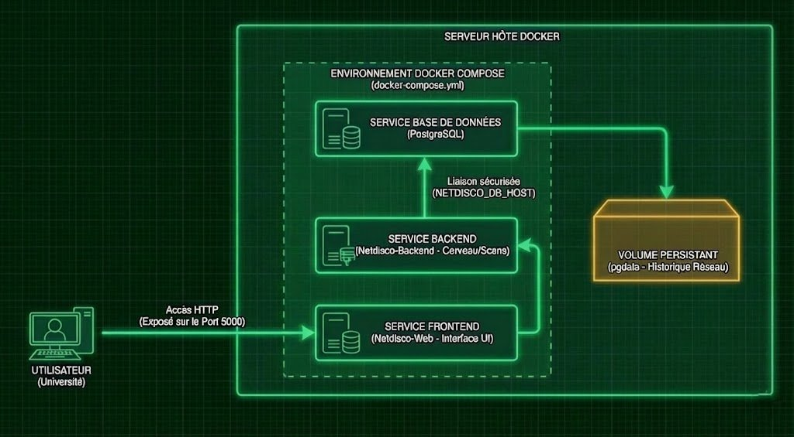
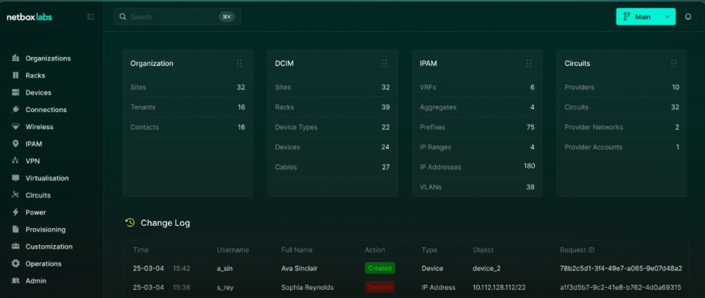

<div align="center">

  

  # 📡 Network Discovery & Inventory Automatsatiion

  **Stage à la DSI de l'UTC (Université Technologique de Compiègne).**

  <p align="center">
    
    
    
    
    
  </p>

  <br>

  [Description](#-description) •
  [Matériel & Stack Technique](#-matériel--stack-technique) •
  [Structure du Projet](#-structure-du-projet) • 
  [Installation & Utilisation](#installation) •
  [Phases du Projet](#-phases-du-projet) •
  [Bilan](#-bilan) •
  [Auteurs](#-auteurs)
</div>

---

## 📝 Description

Ce projet a été réalisé dans le cadre d'un stage à la **Direction des Systèmes d'Information (DSI)** de l'UTC.

Suite à une refonte de l'infrastructure, l'objectif était de créer une **Source de Vérité (SoT)** centralisée et fiable. Le projet couple la puissance de découverte automatique de **NetDisco** (via SNMP/LLDP) avec la gestion rigoureuse de **NetBox** (IPAM/DCIM). Des scripts Python assurent la synchronisation entre les deux entités pour garantir un inventaire toujours à jour sans intervention humaine.

---

## 💻 Matériel & Stack Technique

La solution repose sur une architecture conteneurisée pour assurer portabilité et isolation.

### Infrastructure & Virtualisation


### Applications Core


### Automatisation & Scripts


---

## 📂 Structure du Projet

L'architecture des scripts est organisée pour séparer les données sources de la logique de traitement.

```text
📂 SAE4.01 - Stages et entreprises/
├── 📂 config/
│   ├── ⚙️ deployment.yml               # Configuration du déploiement
│   └── ⚙️ production.yml               # Variables d'environnement de production
│
├── 📂 migration/
│   ├── 📊 netbox_appareils.csv         # Import : Liste des équipements
│   ├── 📊 netbox_cables.csv            # Import : Câblage structuré
│   ├── 📊 netbox_fabricants(2).csv     # Import : Constructeurs (Cisco, HP...)
│   ├── 📊 netbox_sites.csv             # Import : Lieux géographiques
│   ├── 📊 prisecourant.csv             # Import : Prises PDU/Murales
│   └── 📊 vlan.csv                     # Import : Plan d'adressage VLAN
│
├── 📂 netbox-device-autodiscovery/     # 🧠 Cœur de l'automatisation Python
│   │
│   ├── 📂 import_yaml/                 # Module : Importation via fichiers YAML
│   │   ├── 📂 network_devices/         # Dossier source des définitions YAML
│   │   ├── ⚙️ ap-si.yaml               # Exemple de définition d'AP
│   │   ├── 🐍 main.py                  # Point d'entrée principal (Import YAML)
│   │   ├── 🐍 device_manager.py        # Logique de gestion des devices
│   │   ├── 🐍 netbox_api.py            # Wrapper API Netbox
│   │   ├── 🐍 netbox_config.py         # Configuration API (Token, URL)
│   │   ├── 🐍 yaml_processor.py        # Parser de fichiers YAML
│   │   ├── 🐍 mac_ip_assignment.py     # Gestion des adresses MAC/IP
│   │   └── 🐍 utils.py                 # Fonctions utilitaires
│   │
│   └── 📂 modules/                     # Module : Logique modulaire avancée
│       ├── 🐍 run.py                   # Exécuteur de scripts
│       ├── 🐍 configuration.py         # Gestionnaire de configuration
│       ├── ⚙️ configuration.toml       # Fichier de config TOML (exemple)
│       ├── 🐍 logger.py                # Gestion des logs
│       ├── 🐍 netbox_templates.py      # Modèles de données Netbox
│       ├── 🐍 test_script.py           # Tests unitaires/fonctionnels
│       └── ⚙️ pyproject.toml           # Dépendances Python (Poetry/Pip)
│
├── 📂 netdisco-docker/                 # 🐳 Infrastructure de découverte
│   ├── 🐳 docker-compose.yml           # Orchestration des conteneurs Netdisco
│   ├── 📂 netdisco-base/               # Config de base Netdisco
│   │   └── ⚙️ deployment.yml
│   ├── 📂 netdisco-postgresql/         # Scripts d'init Base de Données
│   │   └── 🐚 netdisco-initdb.sh
│   └── 📂 scan_snmp/                   # Scripts de scan réseau
│       ├── 🐍 netdisco_discover.py     # Script de découverte SNMP custom
│       ├── 🐍 clean.py                 # Nettoyage des données brutes
│       └── 📊 ip_list.csv              # Liste des cibles SNMP
│
├── 📄 Rapport de Stage.pdf             # Rapport académique final
├── 📄 Rapport READEme Entreprise.pdf   # Documentation technique pour la DSI
└── 📄 README.md                        # Documentation générale du dépôt
```
---

## ⚙️ <a name="installation"></a>Installation & Utilisation

### 1. Déploiement Docker

* **A. NetBox (IPAM/DCIM)**

```bash
git clone [https://github.com/netbox-community/netbox-docker.git](https://github.com/netbox-community/netbox-docker.git)
cd netbox-docker

# Exposition du port web (Override)
echo 'services:
  netbox:
    ports:
      - "8000:8080"' > docker-compose.override.yml

# Démarrage et création SuperUser
sudo docker compose pull && sudo docker compose up -d
sudo docker exec -it netbox-docker-netbox-1 python3 /opt/netbox/netbox/manage.py createsuperuser
```

* **B. NetDisco (Discovery)**

```bash
git clone [https://github.com/netdisco/netdisco.git](https://github.com/netdisco/netdisco.git)
cd netdisco

# Permissions pour logs et configs
mkdir logs config nd-site-local
chmod 777 logs config nd-site-local

# Configuration SNMP : éditer config/deployment.yml pour ajouter vos communautés
# Lancement
sudo docker compose up -d
```

### 2. Installation du Cœur d'Authentification 
C'est ici que réside la logique métier du projet. Clonez le dépôt contenant les scripts Python de synchronisation :

```bash
# Récupération du dossier essentiel contenant la logique Python
git clone [https://github.com/PierreFamchon/System-Network-Infrastructure.git](https://github.com/PierreFamchon/System-Network-Infrastructure.git)
cd System-Network-Infrastructure
cd Corporate-Security-Integration
cd Professional-Internship-Reports

# Installation des dépendances Python requises
cd netbox-device-autodiscovery
pip install requests pyyaml icecream toml
```

### 3. Configuration des Scripts
Editez le fichier netbox-device-autodiscovery/import_yaml/netbox_config.py avec vos accès :

```python
# netbox_config.py
NETBOX_URL = "[http://192.168.100.160:8000/api/](http://192.168.100.160:8000/api/)"
NETBOX_TOKEN = "votre_token_api_genere_dans_netbox" # ex: 04946ef59...
HEADERS = {
    "Authorization": f"Token {NETBOX_TOKEN}",
    "Content-Type": "application/json",
}
DEBUG_MODE = True
```
### 4. Utilisation / Exécution

* **Étape A :**
  Préparation des données (Export NetDisco) Si vous n'utilisez pas de fichiers YAML manuels, exportez les données découvertes par NetDisco en CSV directement depuis la base de données :

```bash
sudo docker exec -it netdisco-postgresql psql -U netdisco netdisco -c "\copy (SELECT d.name, d.model, d.serial FROM device d) TO '/tmp/devices.csv' WITH (FORMAT CSV, HEADER);"
```

* **Étape B :**
  Lancement de l'automatisation Lancez le script principal pour parser les données et peupler NetBox :

```bash
cd netbox-device-autodiscovery/import_yaml
python3 main.py
```
* (Note : Le script vérifie l'existence du device (Idempotence), crée le modèle s'il est inconnu, configure les interfaces et assigne les IPs de management.)

---

## 📅 Déroulement du Projet
Le projet s'est déroulé en trois phases majeures, transformant une infrastructure manuelle en un système automatisé basé sur une "Source of Truth" (SoT).

### Phase 1 : Architecture & Conteneurisation

* Déploiement de l'écosystème Docker pour héberger la solution de découverte réseau.
* Configuration du docker-compose pour orchestrer les différents services (Base de données PostgreSQL, Backend NetDisco, Interface Web).
* Mise en place des réseaux virtuels Docker pour assurer une communication inter-conteneurs fluide et sécurisée.

<br>

<p align="center">  </p>

<br>

### Phase 2 : Découverte & Inventaire Brut (NetDisco)

* Configuration des protocoles de découverte SNMP (v2c/v3) et LLDP pour scanner l'ensemble du parc informatique.
* Lancement des tâches de "Discovery" pour remonter automatiquement la topologie réseau et les équipements connectés.
* Génération d'un inventaire brut (Raw Data) contenant les adresses MAC, IPs, et les relations de voisinage entre les équipements.

<br>

<p align="center">  </p>

<p align="center">  </p>

<br>

### Phase 3 : Automatisation & Intégration (NetBox)

* Développement de scripts Python pour extraire, nettoyer et structurer les données brutes issues de NetDisco.
* Implémentation d'une logique de synchronisation intelligente vers NetBox (IPAM/DCIM) :
  * POST : Création automatique des nouveaux équipements s'ils n'existent pas.
  * PATCH : Mise à jour des équipements existants (modification de ports, changement d'IP) sans écraser les données manuelles critiques.
* Interaction via l'API REST de NetBox pour peupler les objets structurés (Sites, Fabricants, Racks, Câblage).

<br>

<p align="center">  </p>

<p align="center">  </p>

<br>

---

## 📊 Bilan

La mise en place de cette Source of Truth (SoT) a permis :

* ✅ Centralisation : Un inventaire unique et fiable pour toute la DSI.
* ✅ Automatisation : Fin de la double saisie et réduction drastique des erreurs humaines.
* ✅ Visibilité : Découverte proactive des nouveaux équipements connectés au réseau.

---

## 👥 Auteurs

* Pierre Famchon
  * Étudiant BUT R&T (IUT Béthune)
  * Stagiaire DSI - Université de Technologie de Compiègne
