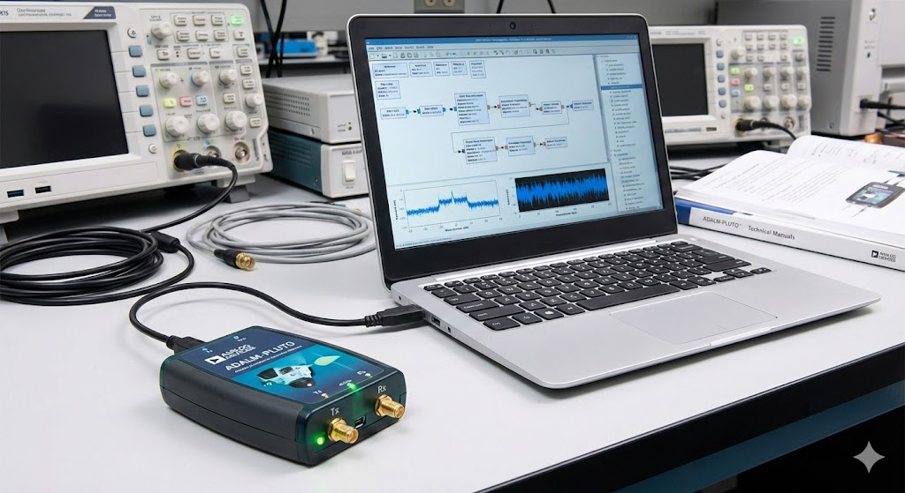
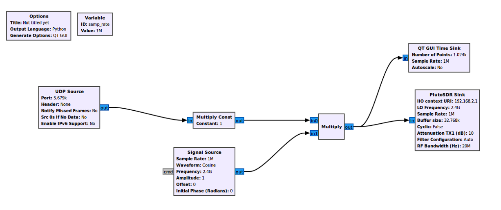

<div align="center">

  

  # SAE 3.01 : Système de Transmission SDR
  
  **Étude, Analyse Spectrale et Transmission Vidéo via Adalm Pluto**

  
  
  
  

  <br>

  [Description](#-contexte-du-projet) •
  [Matériel](#-matériel-et-logiciels) •
  [Installation](#-installation-et-configuration) •
  [Phases du Projet](#-déroulement-du-projet) •
  [Projet Final](#projet-final) •
  [Bilan](#-conclusion) •
  [Auteurs](#-auteurs) 

</div>

---

## 📖 Contexte du Projet

Ce dépôt regroupe les travaux, schémas GNU Radio (`.grc`) et résultats du projet **SAE 3.01** réalisé dans le cadre de la 2ème année de BUT R&T (Réseaux et Télécommunications).

Le projet porte sur l'exploration approfondie de la **Radio Logicielle (SDR)**. Il débute par l'analyse spectrale de l'environnement, passe par la simulation de modulations analogiques, et aboutit à la mise en œuvre d'une **chaîne complète de transmission vidéo** via le module **Adalm Pluto**.

---

## 🛠 Matériel et Logiciels

### 🧰 Équipement Hardware


### 💻 Environnement Software


---

## 🚀 Installation et Configuration

Pour reproduire ces expérimentations, suivez les étapes d'installation ci-dessous.

### 1. Prérequis Système
* Un PC sous **Linux (Ubuntu recommandé)** ou **Windows 10/11**.
* Ports USB 2.0 ou 3.0 disponibles.

### 2. Installation des Pilotes Adalm Pluto
Téléchargez et installez les pilotes nécessaires pour la reconnaissance du périphérique USB :
* [Télécharger les drivers PlutoSDR](https://wiki.analog.com/university/tools/pluto/drivers/windows)

### 3. Installation de GNU Radio
L'environnement principal de développement est GNU Radio.
* **Windows :** Utilisez l'installateur [Radioconda](https://github.com/ryanvolz/radioconda).
* **Linux :**
  ```bash
  sudo apt-get update
  sudo apt-get install gnuradio
   ```
### 4. Récupération du Projet
Clonez ce dépôt pour accéder aux fichiers .grc (GNU Radio Companion) :

  ```bash
git clone [https://github.com/PierreFamchon/System-Network-Infrastructure.git](https://github.com/PierreFamchon/System-Network-Infrastructure.git)
cd Telecoms-Network-Engineering
cd Signal-Transmission-Systems
   ```

### 5. Connexion 
Connectez l'Adalm Pluto en USB. Vérifiez qu'il est reconnu comme un périphérique réseau (généralement 192.168.2.1).

---

## 📡 Déroulement du Projet

### Phase 1 : Prise en main et Analyse Spectrale
Avant toute transmission, une analyse de l'environnement radiofréquence a été réalisée avec le Spectran V4 et le logiciel MCS

* GSM 900 / 1800 : Identification des opérateurs (ex: Vodafone ~ -36 dBm).
* LTE (2.1 GHz) : Visualisation des bandes 4G.
* WiFi (2.4 & 5 GHz) : Observation des canaux 802.11.

Note : Les fichiers .mdr sont disponibles dans le dossier /measurements.

<br>

<p align="center">  </p>

<br>

### Phase 2 : Simulation et Modulation AM
Découverte de GNU Radio via la création de signaux et l'analyse FFT.

* Échantillonnage : Étude de la relation samp_rate / freq_var.
* Résolution Fréquentielle : Delta f = samp_rate / FFT_Size
  * Exemple : Pour 32768 points à 32kHz → Delta f ≈ 0.97 Hz.
* Modulation AM : Multiplication Porteuse $\times$ Modulant et observation des bandes latérales.

### Phase 3 : Réception FM et RDS
Mise en œuvre d'un récepteur FM (88-108 MHz) via l'Adalm Pluto.

* Cible : Skyrock (106.93 MHz).
* Architecture : Source Pluto → Filtre Passe-Bas → Démod WBFM → Audio Sink.
* RDS : Utilisation de gr-rds pour l'extraction des métadonnées (Nom station, Traffic).

### Phase 4 : Émission/Réception Audio (Duplex)
Communication vocale bidirectionnelle entre deux binômes.

<br>

<p align="center">  </p>

<p align="center">  </p>

<br>


*  Technique : Modulation FM de la voix (48kHz) sur porteuse 2.4 GHz.
*  Flux : Remplacement des blocs UDP par PlutoSDR Sink/Source.
*  Résultat : Full Duplex fonctionnel vérifié par analyseur de spectre.

<br>

<p align="center">  </p>

<br>

---

## 🎥 <a name="projet-final"></a>Projet Final : Transmission Vidéo (Streaming)
L'objectif ultime : transmettre un flux vidéo MP4 d'un PC à un autre par ondes radio.

### Architecture du Système

* Émission (PC A + Pluto A)
     * VLC : Lecture MP4 → Stream vers UDP :5679.
     * GNU Radio : UDP Source → Modulation GMSK/FM → Pluto Sink (2.4 GHz).

* Transmission
     * Signal RF à 2.4 GHz via antennes.

* Réception (Pluto B + PC B)
     * GNU Radio : Pluto Source → Démodulation → UDP Sink (IP Cible:5680).
     * VLC : Lecture flux réseau udp://@:5680.

### Résultats Obtenus
* ✅ Vidéo transmise (Codec H.265 + Audio MP3).
* ✅ Fluidité correcte et faible latence.
* ✅ Validation de la capacité de débit du PlutoSDR.

---

## 🔚 Conclusion
Ce projet a permis de valider des compétences clés en télécommunications :

* 🔧 Hardware : Calibration SDR et manipulation d'antennes.
* 📶 Signal : Traitement numérique (DSP) avec GNU Radio.
* 🔄 Protocoles : Compréhension des chaînes de transmission (UDP, Modulation).
* 🐞 Debug : Résolution de problèmes sur une chaîne complexe.

---

## 👥 Auteurs

* **Auteurs :** Pierre Famchon & Michel Bauchart
* **Formation :** BUT R&T - IUT de Béthune
* **Année :** 2024-2025
* **Objectif :** Comprendre les concepts de la transmission numérique/analogique et maîtriser la chaîne de traitement SDR.
